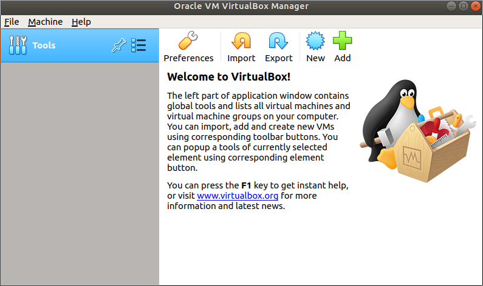

> ## Helpline
>
> Remember that we are always available to help.  Our [Mattermost][mattermost] channel is open.
{: .callout}

## Downloading VirtualBox

VirtualBox is a free, open source and multiplatform hypervisor application to run virtual machines.  The latest version is `6.1.22` and is available for most platforms at the VirtualBox [download](https://www.virtualbox.org/wiki/Downloads) site. Note that you will need administrative permissions on your machine in order to install it.

> The latest tested version of VirtualBox working with this CMS-specific CernVM image is `6.1.10`. Pick that one if you have troubles with the latest version. The full history of VirtualBox versions is available on a [different page](https://www.virtualbox.org/wiki/Download_Old_Builds).
{: .testimonial}

## Installing VirtualBox

> ## Find your way to install VirtualBox!
> Now go ahead with the installation! After you download the appropiate installer file, proceed as you would with any other program in your system. It shouldn't take long.  Afterwards, you can open the program, just to test it has been intalled correctly.
>> ## Meet your hypervisor
>>
>> If installed correctly, after opening the program a window similar to this one should emerge:
>> 
> {: .solution}
{: .challenge}


