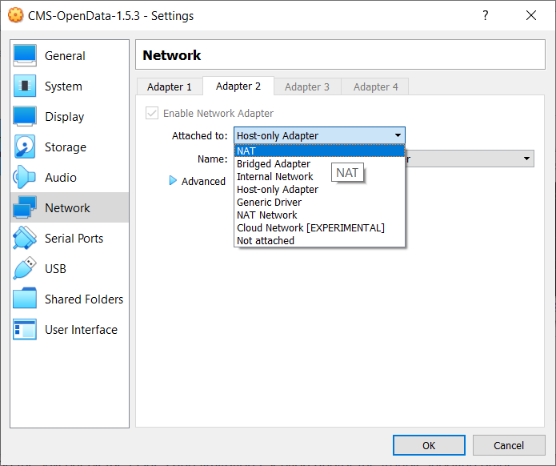
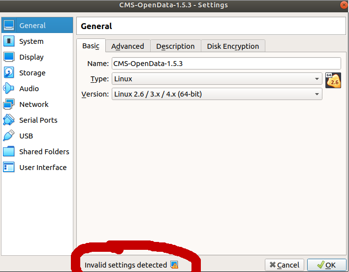

> ## Helpline
>
> Remember that we are always available to help.  Our [Mattermost][mattermost] channel is open.
{: .callout}

## Downloading the CMS-specific CernVM image

Download the 2011 CMS-specific CernVM image as OVA file from the official [record](http://opendata.cern.ch/record/252) in the Cern Open Portal site. We recommend using version 1.5.3, i.e., [CMS-OpenData-1.5.3](http://opendata.cern.ch/record/252/files/CMS-OpenData-1.5.3.ova). This VM Image can be used for data from 2011 and 2012, which are the data we will use in this workshop.

> Make sure to download version of the *ova* file, `1.5.3`.  Other versions are deprecated.
{: .testimonial}

## Importing the image into VirtualBox

By double clicking the downloaded file, VirtualBox imports the image with ready-to-run settings.  The import could also be triggered directly from the VirtualBox interface through the `File > Import Appliance` menu option.  But before that,

> make sure you **unselect** *import hard drives as VDI* on the initial import screen.  Otherwise, it is very likely that the VM won't boot.
{: .testimonial}

## Launching the CMS VM

After importing, it is likely that you will have to make at least one last change to the default settings before launching:

> Change the Network settings for adapter 2 from *Host-only Adapter* to *NAT*.
{: .testimonial}

>Also, check for any *Invalid settings detected* at the bottom of the window after you click on the Settings button, and make the appropriate changes following those recommendations.
{: .testimonial}

Finally, launch the CMS-specific CernVM, by clicking on it in the list of VMs and then on the *Start* button.  It will boot into the graphical user interface and sets up the CMS environment. Be patient, the first time **it will take a while.**

> Note: If you encounter any problems with booting the VM check the [issues and limitations](http://opendata.cern.ch/docs/cms-virtual-machine-2011#issue) section and/or [the troubleshooting guide](http://opendata.cern.ch/docs/cms-guide-troubleshooting).
{: .testimonial}

If installed correctly, after the import procedure is complete, you will see something like these [screenshots](https://www.virtualbox.org/wiki/Screenshots).


