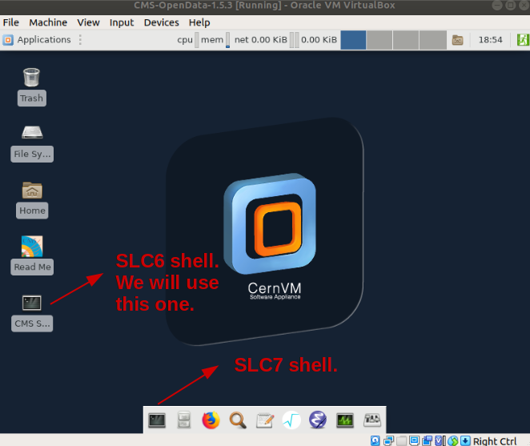

> ## Helpline
>
> Remember that we are always available to help.  Our [Mattermost][mattermost] channel is open.
{: .callout}

## Know your VM

The virtual machine we just installed provides CMS computing environment to be used with the 2011 and 2012 CMS open data. The virtual machine is based on the [CernVM](https://cernvm.cern.ch/) and uses Scientific Linux CERN.  As it was mentioned before, it comes equipped with the [ROOT](http://root.cern.ch/) framework and [CMSSW](http://cms-sw.github.io/).

An important feature of the VM is the availability of the [CernVM File System](https://cernvm.cern.ch/fs/).  Thanks to the cvmfs client installed, the VM gets the CMS software (CMSSW) from the shared `/cvmfs/cms.cern.ch` area (physically at CERN but mounted locally) and the jobs, running on the CMS open data VM, read the conditions data from `/cvmfs/cms-opendata-conddb.cern.ch`. Certain kind of information, like the trigger prescales, need access to these conditions data. Access to the data itself is through [XRootD](https://xrootd.slac.stanford.edu/).

The VM has a 40G virtual hard disk and a 20G cvmfs cache, which is large enough for condition data for full event range for 2012 data (see the [CMS guide to the condition database](http://opendata.cern.ch/record/252) for further details). It has an embedded Scientific Linux CERN 6 (slc6) shell, where all CMS software specific commands should be executed. Additionally, it has a CERN Scientific Linux CERN 7 (slc7) shell, which can be used in the same session.

## Run a simple *demo* for testing and validating

The validation procedure tests that the CMS environment is installed and operational on your virtual machine, and that you have access to the CMS Open Data files.  It also access the conditions data from the shared cvmfs area and caches them.  This last action will save us time during the workshop.  These steps also give you a quick introduction to the CMS environment.

In the VM, open a terminal from the *CMS Shell* **icon from the desktop** (note that the X terminal emulator from an icon bottom-left of the VM screen opens a shell with an operating system incompatible with the CMS software release to be used).



> **IMPORTANT NOTE**: Depending on your system, there could be some issues with the shared clipboard between the host machine and the virtual machine.  This means that it is possible that you cannot copy the instructions in this episode directly into your VM session.  The quickest workaround is to use the [text dump file](../files/lessonDump.txt) of the lesson. You can download this file directly in your VM, e.g., the `wget`  command, and follow along to copy the necessary commands directly from the text file.
{: .testimonial}

> ## Alternative solution to the clipboard problem
> Another possibility is to use the `ssh` and/or `scp` commands to copy the required files to some other machine that you have access to, from the VM as well as from the host machine.  For instance, if you had access to an `lxplus` computer at cern, you could copy a certain file from the VM to the lxplus computer.  On the VM you could do:
>
> ~~~
> scp myfile.txt myusername@lxplus.cern.ch:.
> ~~~
> {: .language-bash}
>
> to copy a hypothetical file `myfile.txt` to lxplus, and then on the host
>
> ~~~
> scp myusername@lxplus.cern.ch:myfile.txt .
> ~~~
> {: .language-bash}
>
> to copy the same file back to your host machine.  Then you can edit the file locally and reverse the process to get it back to your VM.
>
> It could also be possible to have direct access from the host to the VM.  This [youtube tutorial](https://www.youtube.com/watch?v=ErzhbUusgdI) might be of help for that option.
{: .solution}


Execute the following command; this command builds the local release area (the directory structure) for CMSSW, and only needs to be run once (note that it may take a while):

~~~
cmsrel CMSSW_5_3_32
~~~
{: .language-bash}

> Note that if you get a warning message about the current OS being SLC7, you are using a wrong terminal. Open a "CMS Shell" terminal as explained above and execute the cmsrel command there.
{: .testimonial}

Change to the CMSSW_5_3_32/src/ directory:

~~~
cd CMSSW_5_3_32/src/
~~~
{: .language-bash}

Then, run the following command to create the CMS runtime variables:

~~~
cmsenv
~~~
{: .language-bash}

Create a working directory for the demo analyzer, change to that directory and create a *skeleton* for the analyzer:

~~~
mkdir Demo
cd Demo
mkedanlzr DemoAnalyzer
~~~
{: .language-bash}

Come back to the main `src` area:

~~~
cd ../
~~~
{: .language-bash}

Compile the code:

~~~
scram b
~~~
{: .language-bash}

You can safely ignore the warning.


Before launching the job, let's modify the configuration file (do not worry, you will learn about all this stuff in a different [lesson](https://cms-opendata-workshop.github.io/workshop2011-lesson-cmssw/)) so it is able access a CMS open data file and cache the conditions data.  As it was mentioned, this will save us time later.

Open the `demoanalyzer_cfg.py` file using the `vi` editor ([here](https://www.thegeekdiary.com/basic-vi-commands-cheat-sheet/) you can find a good cheatsheet for that editor). Note that other editors like `emacs` or `nano` are also avilable in the VM.

~~~
vi Demo/DemoAnalyzer/demoanalyzer_cfg.py
~~~
{: .language-bash}

Replace `'file:myfile.root'` with `'root://eospublic.cern.ch//eos/opendata/cms/Run2011A/ElectronHad/AOD/12Oct2013-v1/20001/001F9231-F141-E311-8F76-003048F00942.root'` to point to an example file.  Note that the access to this file will be done using the `XRootD` protocol mentioned above.

Chage also the maximum number of events to 10.  I.e., change `-1`to `10` in `process.maxEvents = cms.untracked.PSet( input = cms.untracked.int32(-1))`.

In addition, insert, below the *PoolSource* module, the following lines:

```
#needed to cache the conditions data
process.load('Configuration.StandardSequences.FrontierConditions_GlobalTag_cff')
process.GlobalTag.connect = cms.string('sqlite_file:/cvmfs/cms-opendata-conddb.cern.ch/FT_53_LV5_AN1_RUNA.db')
process.GlobalTag.globaltag = 'FT_53_LV5_AN1::All'
```

The lines above are intended to access to the *condition data*, such as the jet-energy corrections, trigger information, etc. You will learn about them in a later lesson.  Right now it is sufficient to mention that it is a good idea to cache these data already so later in the workshop we can speed up the processing.

> ## Take a look at the final validation config file
>
> At the end, the config file should look like
>
> ~~~
> import FWCore.ParameterSet.Config as cms
> process = cms.Process("Demo")
> process.load("FWCore.MessageService.MessageLogger_cfi")
> process.maxEvents = cms.untracked.PSet( input = cms.untracked.int32(10) )
> process.source = cms.Source("PoolSource",
> # replace 'myfile.root' with the source file you want to use
>    fileNames = cms.untracked.vstring(
>        'root://eospublic.cern.ch//eos/opendata/cms/Run2011A/ElectronHad/AOD/12Oct2013-v1/20001/001F9231-F141-E311-8F76-003048F00942.root'
>    )
> )
> #needed to cache the conditions data
> process.load('Configuration.StandardSequences.FrontierConditions_GlobalTag_cff')
> process.GlobalTag.connect = cms.string('sqlite_file:/cvmfs/cms-opendata-conddb.cern.ch/FT_53_LV5_AN1_RUNA.db')
> process.GlobalTag.globaltag = 'FT_53_LV5_AN1::All'
>
> process.demo = cms.EDAnalyzer('DemoAnalyzer'
> )
>
> process.p = cms.Path(process.demo)
> ~~~
> {: .language-python}
{: .solution}

Make symbolic links to the conditions database files from cvmfs:

~~~
ln -sf /cvmfs/cms-opendata-conddb.cern.ch/FT_53_LV5_AN1_RUNA FT_53_LV5_AN1
ln -sf /cvmfs/cms-opendata-conddb.cern.ch/FT_53_LV5_AN1_RUNA.db FT_53_LV5_AN1_RUNA.db
~~~
{: .language-bash}

and make sure the cms-opendata-conddb.cern.ch directory has actually expanded in your VM. One way of doing this is executing:

~~~
ls -l /cvmfs/
~~~
{: .language-bash}

~~~
total 18
drwxr-xr-x  8 root root 4096 Jan 13  2014 cernvm-prod.cern.ch
drwxr-xr-x 69  989  984 4096 Aug 29  2014 cms.cern.ch
drwxr-xr-x 14  989  984 4096 Dec 16  2015 cms-opendata-conddb.cern.ch
drwxr-xr-x  4  989  984 4096 May 28  2014 cvmfs-config.cern.ch
~~~
{: .output}

Finally, run the cms executable with our configuration (it may really **take a while**, but the next time you want to run it will be faster):
~~~
cmsRun Demo/DemoAnalyzer/demoanalyzer_cfg.py
~~~
{: .language-bash}

~~~
%MSG-w LocalFileSystem::initFSList():  (NoModuleName) 15-Jun-2021 00:25:34 GMT  pre-events
Cannot read '/etc/mtab': Invalid argument (error 22)
%MSG
15-Jun-2021 01:42:26 GMT  Initiating request to open file root://eospublic.cern.ch//eos/opendata/cms/Run2011A/ElectronHad/AOD/12Oct2013-v1/20001/001F9231-F141-E311-8F76-003048F00942.root
15-Jun-2021 01:42:35 GMT  Successfully opened file root://eospublic.cern.ch//eos/opendata/cms/Run2011A/ElectronHad/AOD/12Oct2013-v1/20001/001F9231-F141-E311-8F76-003048F00942.root
Begin processing the 1st record. Run 166782, Event 340184599, LumiSection 309 at 15-Jun-2021 01:42:46.636 GMT
Begin processing the 2nd record. Run 166782, Event 340185007, LumiSection 309 at 15-Jun-2021 01:42:46.637 GMT
Begin processing the 3rd record. Run 166782, Event 340187903, LumiSection 309 at 15-Jun-2021 01:42:46.638 GMT
Begin processing the 4th record. Run 166782, Event 340227487, LumiSection 309 at 15-Jun-2021 01:42:46.638 GMT
Begin processing the 5th record. Run 166782, Event 340210607, LumiSection 309 at 15-Jun-2021 01:42:46.639 GMT
Begin processing the 6th record. Run 166782, Event 340256207, LumiSection 309 at 15-Jun-2021 01:42:46.640 GMT
Begin processing the 7th record. Run 166782, Event 340165759, LumiSection 309 at 15-Jun-2021 01:42:46.640 GMT
Begin processing the 8th record. Run 166782, Event 340396487, LumiSection 309 at 15-Jun-2021 01:42:46.641 GMT
Begin processing the 9th record. Run 166782, Event 340390767, LumiSection 309 at 15-Jun-2021 01:42:46.641 GMT
Begin processing the 10th record. Run 166782, Event 340435263, LumiSection 309 at 15-Jun-2021 01:42:46.642 GMT
15-Jun-2021 01:42:46 GMT  Closed file root://eospublic.cern.ch//eos/opendata/cms/Run2011A/ElectronHad/AOD/12Oct2013-v1/20001/001F9231-F141-E311-8F76-003048F00942.root

=============================================

MessageLogger Summary

 type     category        sev    module        subroutine        count    total
 ---- -------------------- -- ---------------- ----------------  -----    -----
    1 fileAction           -s file_close                             1        1
    2 fileAction           -s file_open                              2        2

 type    category    Examples: run/evt        run/evt          run/evt
 ---- -------------------- ---------------- ---------------- ----------------
    1 fileAction           PostEndRun                        
    2 fileAction           pre-events       pre-events       

Severity    # Occurrences   Total Occurrences
--------    -------------   -----------------
System                  3                   3
~~~
{: .output}


